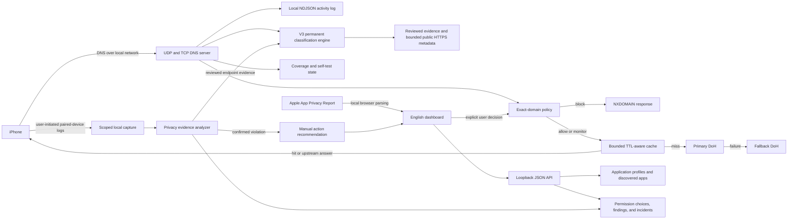

# Privacy Protector

Privacy Protector is a local-first Windows application for inspecting iPhone network activity, analyzing Apple App Privacy Report files, applying reversible exact-domain DNS rules, and recording privacy-permission verification results from a paired iPhone. DNS Engine V3 preserves the resilient V2 transport core and adds permanent evidence-based domain classification with immediate preliminary results, bounded public-metadata study, purpose-aware application context, and explicit green, orange, and red privacy states without payload interception. A lightweight background launcher can keep all DNS hostnames that traverse the engine under observation from Windows sign-in, even while the dashboard window is closed.

The project is defensive. It does not jailbreak the phone, inject code, patch iOS applications, bypass application security checks, read account data, or place itself between an application and its encrypted payload. Its protection boundary is DNS and local evidence analysis.

## Technical overview

| Item | Description |
|---|---|
| Operating model | Local Windows application with an English LTR web interface |
| Backend | Python standard-library HTTP server, the isolated `dns_engine.py` protocol engine, and `domain_classifier.py` for V3 classification |
| Frontend | Static HTML, CSS, and vanilla JavaScript |
| Dashboard address | `http://127.0.0.1:8733` |
| Test DNS port | `53053` |
| iPhone DNS port | `53` over UDP and TCP |
| Primary upstream resolver | Cloudflare DNS-over-HTTPS at `https://cloudflare-dns.com/dns-query` |
| Fallback upstream resolver | Google Public DNS-over-HTTPS at `https://dns.google/dns-query` |
| DNS cache | Memory-only, bounded to `2,048` entries, with positive and negative TTL enforcement |
| Coverage and self-test | Measured UDP, TCP, provider, cache, client-attribution, error, and self-test state |
| Python baseline | Python `3.12` |
| Paired-device connector | `pymobiledevice3` for optional iPhone inventory, read-only status, user-initiated evidence capture, and USB packet attribution |
| Automated validation | Deterministic protocol, cache, local mock-DoH integration, concurrency, V3 classification, safe-probe, API, UI-contract, and privacy-documentation coverage |

## What the application does

Privacy Protector combines related privacy workflows in one local dashboard.

| Workflow | What it does | What it does not do |
|---|---|---|
| Live DNS protection | Receives UDP and TCP DNS requests, matches exact normalized hostnames against saved policy, blocks selected hosts with an NXDOMAIN response, and forwards all other requests through primary or fallback encrypted DNS-over-HTTPS | It does not inspect HTTPS contents, passwords, messages, banking data, application payloads, or function names |
| Engine assurance | Measures transport and provider state, exposes cache and error health, and runs a local self-test for UDP, TCP, policy actions, logging, and both DoH providers | A passing test proves the tested DNS path at that time; it does not prove that every iPhone or application connection traverses the engine |
| V3 domain study | Permanently records every observed hostname, assigns an immediate preliminary green/orange/red classification, combines reviewed catalog evidence with DNS type, CNAME, app context, permission findings, and a bounded HTTPS-root metadata study, then exposes the reason and confidence | It does not read device files, cookies, account paths, request bodies, encrypted payloads, or arbitrary authenticated pages; a classification is evidence-based but is not a claim that DNS can see an encrypted function call |
| App Privacy Report analysis | Reads an Apple NDJSON report in the browser, keeps `networkActivity` rows, groups domains by bundle identifier, and saves discovered application/domain relationships locally | It does not upload the report to a server |
| Automatic application attribution | When an unlocked paired iPhone is connected by USB, reads Apple `pcapd` per-packet process metadata and links plain DNS questions to the matching installed-app display name and bundle ID | It stores only bounded DNS/app attribution evidence, not packet bodies; without USB or report evidence, DNS-only rows remain explicitly unattributed |
| Per-application observation | Records DNS requests that occur while the user manually opens one selected application, then attaches the observed domains to that local application profile | DNS alone cannot prove which application initiated a request unless the relationship is supported by the imported report or a dedicated observation session |
| Permission verification | On explicit user request, captures a selected iOS process log and a parallel system log, then searches for location, motion, tracking, SDK, and development-environment indicators | It cannot directly revoke another application's iOS permissions, continuously measure internal function calls, or prove that an unobserved action never occurred |
| Manual operations review | Moves a selected hostname out of the activity presentation and into a separate operations workspace with timing, filtering, and sorting | Transfer alone does not create, change, or delete a DNS rule; enforcement still requires an explicit hostname action |
| Lightweight background service | Starts at Windows sign-in when installed, listens for every DNS request that reaches the configured resolver, maintains classification, and continues after the dashboard closes | It does not start a second continuous iPhone observer, continuously capture iOS logs, or see traffic that bypasses the configured DNS path |

## Core design principles

| Principle | Implementation |
|---|---|
| Local-first | The dashboard is bound to loopback by default and runtime state is stored as local JSON or NDJSON files |
| Exact matching | DNS rules match complete normalized hostnames only; wildcard blocking is intentionally not used |
| Reversible decisions | Every managed domain can be changed among allow, monitor, and block, or removed from policy |
| Conservative attribution | General DNS activity is not assigned to an application without report or session evidence |
| Visible attribution provenance | Every activity application label states whether it came from exact iOS process metadata, an Apple App Privacy Report, saved profile evidence, or DNS-only traffic with no attribution |
| Honest device control | Developer Mode is read from the paired iPhone but is never changed remotely |
| Privacy-first defaults | New monitored applications default to deny for location, motion, and tracking; DNS enforcement remains a separate manual decision |
| Manual enforcement | Discovery, classification, and permission evidence never create or restore DNS policy automatically; the user explicitly moves a hostname into operations and then selects allow, monitor, or block |
| Bounded resilience | Public DoH failures use a separately configurable fallback, upstream waits are bounded, and a recovered primary is selected again |
| TTL-correct caching | Positive and negative answers expire according to DNS TTL data; cached transaction IDs and remaining TTLs are rewritten per client response |
| Measured coverage | The interface reports what the engine actually received and tested instead of publishing an unsupported detection percentage |
| Permanent classification inventory | Clearing DNS activity, moving a hostname into operations, or hiding an operations-tray item never deletes its permanent V3 domain record; moving it changes presentation only and removes the duplicate activity row while it remains in operations |
| Separated meanings | DNS record type, policy action, application process, host-purpose category, privacy risk, analysis stage, and confidence are stored and displayed as separate concepts |
| Operations/policy separation | The browser stores the visible operations tray independently from exact-domain policy; removing or clearing an operations-tray item never deletes or changes its saved DNS rule |
| Purpose-aware context | Expected first-party access required by an optional health or fitness application's declared purpose can be capped at orange, while unrelated third-party advertising, attribution, or behavioral analytics retains its independent red classification |
| Lightweight continuity | The sign-in launcher starts one hidden DNS/classification service only; optional USB packet attribution and user-initiated log capture are separate and are not enabled by the normal background path |

## Architecture



## End-to-end data flow

| Stage | Input | Processing | Stored result |
|---|---|---|---|
| DNS reception | Raw UDP or TCP DNS packet from a client | Validates one question, normalizes case, terminal dots, and IDNA, preserves EDNS and DNSSEC-related wire data, and checks exact policy | An enriched activity event with client, query type, transport, decision, response code, latency, upstream, cache state, and bounded error detail |
| DNS blocking | Exact hostname whose action is `block` | Returns an NXDOMAIN response without calling the upstream resolver | A `blocked` activity event |
| Activity timing summary | Persisted DNS request records | Aggregates each hostname's observation count, block count, latest observation time, latest block time, and latest action across the bounded in-memory history | A `domainStats` object returned with `/api/logs`; repeated requests update the latest timestamps without deleting earlier events |
| DNS cache | An `allow` or `monitor` query | Uses a question-and-wire-aware key; serves only unexpired positive or negative entries; rewrites the client transaction ID and remaining TTL | A `cache: hit` event or an upstream miss |
| DNS forwarding | A cache miss for `allow`, `monitor`, or an unknown exact hostname | Sends the original DNS wire message to primary DoH, retries a truncated encrypted response, and uses the fallback after bounded failure | Provider, upstream latency, failover reason, truncation retry, response code, and CNAME targets when available |
| DNS assurance | User starts the compact self-test | Sends reserved local test queries through the running UDP and TCP listeners and checks primary and fallback DoH directly | Explicit per-check pass/fail state retained in memory and exposed through the coverage API |
| V3 preliminary classification | A valid hostname first appears in DNS, policy, a saved profile, or an imported report | Applies reviewed exact-host mappings and bounded hostname/description signals; always emits green, orange, or red plus the `preliminary` or `studied` stage; startup imports are accumulated in memory and committed once instead of rewriting the classification store for every item | A permanent entry in the private runtime classification store; no “unclassified” placeholder is created, and `lastObservedAt` changes only after a real DNS/report observation |
| V3 active study | A new preliminary hostname is queued or the user selects **V3 Study** | Resolves only public addresses, rejects loopback/private/reserved targets, connects to HTTPS port 443 with normal certificate validation, requests only `/` without cookies or redirects, caps the response, and retains only status, selected headers, title/description, certificate organization, and a hashed address | Updated stage, reason, confidence, evidence list, public metadata, DNS types, transports, policy decisions, CNAME targets, and application contexts; no page body, IP address, cookie, credential, or device content is retained |
| V3 confirmed privacy evidence | A user-initiated permission capture proves a denied location, motion, or tracking use, or detects a reviewed device-integrity indicator tied to a known endpoint | Overrides the affected endpoint to red/studied with high local confidence without claiming that an internal function call was measured | A permanent red domain classification and a local evidence label; exact-domain policy remains separately user-controlled |
| Purpose-aware application context | An observed hostname is linked to an application profile with a reviewed purpose definition | Caps only expected first-party health or fitness access at orange when the evidence category is compatible with that purpose | A contextual classification explanation; unrelated advertising, attribution, analytics, integrity, or other third-party evidence remains independently classified and may stay red |
| Operations transfer | User moves a hostname from activity | Adds a browser-local operations-tray key, removes the duplicate row from the activity presentation, and preserves the permanent classification and DNS history | A hostname operation with observation/block timing and manual DNS actions |
| Report import | Apple NDJSON file selected in the browser | Parses each line independently, ignores malformed lines, keeps network activity, detects apps, and groups domains | Detected applications and confirmed domain relationships in the private runtime store |
| USB process attribution | Plain DNS packet metadata exposed by Apple `pcapd` while the unlocked paired iPhone is connected by cable | Extracts only the DNS question and Apple-supplied process/PID metadata, maps the executable to the installed-app inventory, and discards all other packet content | A bounded `appDomain` event in the private runtime attribution store |
| Manual app scan | DNS events created after the user starts an app session | Deduplicates domains and records hit counts | Observed domains attached to the selected app profile |
| Paired-iPhone inventory | `pymobiledevice3 apps list` output | Extracts bundle ID, display name, and executable name | Detected application inventory in the private runtime store |
| Permission capture | User-started app-specific log plus a parallel system log | Detects observable location, motion, tracking, generic system-protection signals, and development-environment indicators | Last result, evaluation, and optional incident under the private runtime directory; no continuous internal-function inventory |
| Manual protection decision | A confirmed violation identifies related reviewed endpoints | Stores the violation, marks linked endpoints red/studied, and recommends candidate hostnames without changing policy | Permanent evidence remains in the activity inventory until the user moves a hostname into operations and chooses an action |

## Privacy evidence model

The permission center stores what the user wants, what the latest capture observed, and an evaluation that compares the two.

| Category | Desired states | Observed evidence | Possible evaluation |
|---|---|---|---|
| Location | `allow`, `monitor`, `deny` | Calls that start location updates and delivered location updates | Allowed, observed, protected, violation, not observed, or not verified |
| Motion | `allow`, `monitor`, `deny` | Core Motion sessions and device-motion samples | Allowed, observed, protected, violation, not observed, or not verified |
| Tracking | `allow`, `monitor`, `deny` | App Tracking Transparency checks and authorization status | Allowed, observed, protected, violation, not observed, or not verified |
| System-state reporting | `monitor`, `block` | Known device-environment or security-SDK signals | A reversible exact-domain rule when a supported endpoint is known |
| Enforcement recommendation | Manual | Confirmed violation plus known privacy endpoint evidence | Alert and related-host recommendation only; no automatic policy write |

An incident is created only when a category set to `deny` is observed as used or authorized. Incidents are marked high severity, saved locally, deduplicated by capture time, bundle ID, and violated categories, and limited to the latest `200` records.

## Manual exact-domain policy

Startup does not add, restore, or change DNS rules. Reviewed advertising, analytics, attribution, diagnostics, and device-environment mappings improve classification only. They do not become policy until the user explicitly moves a hostname from activity to operations and selects allow, monitor, or block.

The mode deliberately avoids wildcard rules. Blocking `example.test` does not block `api.example.test`, and blocking `api.example.test` does not block the parent domain. This reduces accidental breakage but means every protected hostname must be known explicitly.

Application-specific endpoint catalogues are implementation data and should contain only reviewed, purpose-specific mappings. Exact matching keeps every decision narrow, inspectable, and reversible.

## DNS Engine V3 classification model

V3 does not derive privacy risk from the policy action. A manually blocked host is not automatically red, and an allowed host is not automatically green. The classification engine evaluates purpose and evidence independently; policy remains the separate enforcement choice.

| Color | V3 meaning | Typical evidence |
|---|---|---|
| Green | Functional, first-party, authentication, content, update, security, or privacy-protection infrastructure with no identified device-privacy intrusion | Reviewed provider role, functional hostname, certificate/HTTPS metadata, or infrastructure relationship |
| Orange | The service can use operational device, diagnostic, notification, subscription, product, or expected first-party health/fitness data, but the available evidence does not establish unrelated tracking or a confirmed denied-privacy violation | Crash reports, logging, push delivery, installation identifiers, device provisioning, multi-purpose services, or reviewed first-party access that is integral to an optional health application's declared purpose |
| Red | Tracking, third-party advertising attribution, behavior/session analytics, audience identity, unrelated collection of location/motion/health data, a locally confirmed denied-permission use, or a reviewed device-integrity check | Reviewed vendor documentation, explicit analytics/advertising role, App Privacy Report context, local permission violation, containment evidence, or development-environment indicators tied to an endpoint |

Every entry also has an analysis stage. `preliminary` is an immediate machine classification and remains visibly labeled as preliminary. `studied` means that the engine has reviewed an exact catalog record, local permission evidence, or bounded public DNS/HTTPS metadata. Confidence remains explicit because a hostname and public root response still cannot reveal an encrypted API path or request body.

Application purpose is contextual evidence, not a blanket exception. A reviewed optional health or fitness app can make expected first-party health access orange at most, because that access is intrinsic to the app's user-selected purpose. The same app's third-party advertising, attribution, or behavioral analytics domains are still evaluated independently and can remain red. Government, medical-record, appointment, or other sensitive services are not automatically treated as optional health readers.

The bundled catalogue contains only neutral reserved examples. Organization-specific mappings belong in local configuration and must remain separate from distributable source while the generic classification engine retains its three-color contract.

## User interface

The dashboard is a single English LTR page with local JavaScript state and loopback API calls.

| Area | Main controls | Behavior |
|---|---|---|
| Header | **Check Developer Mode**, permission center, detected applications, report import | Opens local dialogs or reads a local file; no remote upload is performed |
| Summary cards | Rows, monitored apps, domains, blocked rules | Shows the current report, local inventory, and DNS service status |
| DNS engine strip | UDP/TCP receipt, healthy DoH providers, client-attribution state, self-test, and **V3 Study** | Reports measured state compactly and queues bounded study for preliminary entries |
| Activity table | Application filter, risk filter, V3 study, and sorting by latest time, application, hostname, or classification | Displays every matching live DNS event, imported report row, and permanent V3 hostname except items currently shown in operations; each application name includes its attribution source, and DNS-only rows are labeled as unattributed |
| Protection operations | Manual hostname transfer, filter, sorting by latest observation, latest block, name, or classification, allow/monitor/block controls, removal from the workspace, and blocklist export | Starts empty, displays only hostnames the user transfers from activity, shows latest observation and block timing plus counts, and creates no policy until the user explicitly selects an action |
| Permission center | Desired permission choices, system protection, manual action recommendations, capture controls, and incident export | Saves choices, starts paired-iPhone evidence capture, analyzes results, and exports incident JSON without automatic containment |

The two main dashboard panels do not use previous/next pagination or nested vertical scrolling. All matching activity rows that are not currently transferred and all privacy-protection operations are rendered in full, and the browser page provides the single vertical scrollbar for reviewing them from top to bottom.

## Check Developer Mode

The **Check Developer Mode** button is located in the dashboard header. It opens a dedicated dialog and asks the local backend to read the real Developer Mode state from the paired iPhone through `/api/developer-mode/status`.

| Result | Meaning shown to the user |
|---|---|
| Developer Mode is off | The dialog confirms that Developer Mode is not active and is therefore not exposed to applications as an enabled device state |
| Developer Mode is on | The dialog explains that it remains visible to applications and directs the user to turn it off in iPhone Settings, then use **Check now** to verify again |
| Device is unavailable | The dialog explains that the iPhone, pairing record, connector, or local-network discovery could not be reached and offers another check |

The button is deliberately read-only. It does not spoof the device state, conceal an enabled Developer Mode, bypass an application's security checks, or turn Developer Mode off remotely. The actual change must be made on the iPhone; Privacy Protector only verifies the resulting state and reports it honestly.

## Report format

The browser accepts newline-delimited JSON. Each line is parsed independently. Malformed lines are counted and ignored. Only rows whose `type` is `networkActivity` are shown as report activity.

The fields used by the interface are shown below. Extra fields remain in browser memory for the current page session but are not required by the parser.

| Field | Purpose |
|---|---|
| `type` | Must be `networkActivity` for the row to appear |
| `bundleID` | Identifies the originating application when Apple supplies it |
| `domain` | Hostname contacted by the application |
| `domainType` | Helps classify tracking-related activity |
| `timeStamp` | Used for sorting, display, and report duration |
| `context` | Optional display context |
| `appName`, `displayName`, `applicationName` | Optional names used when discovering an application |

## Local API

The dashboard API is served by `DashboardHandler` in `app.py`. Read endpoints return JSON with `Cache-Control: no-store`. State-changing requests are rejected unless their `Host` header is loopback.

| Method | Path | Purpose |
|---|---|---|
| `GET` | `/api/health` | Minimal service health check |
| `GET` | `/api/status` | DNS port, uptime, blocked-domain count, activity summary, corrupt-line count, compact resolver coverage, V3 classification summary, and optional USB packet-attribution state |
| `GET` | `/api/dns/coverage` | Full measured transport, provider, cache, client-attribution, recent-error, blind-spot, and last-self-test state |
| `POST` | `/api/dns/self-test` | Run UDP, TCP, allow, monitor, block, logging, primary-DoH, and fallback-DoH checks; send an empty JSON object |
| `DELETE` | `/api/dns/cache` | Clear only memory-resident DNS answers; preserve policy, apps, privacy controls, and activity history |
| `GET` | `/api/classifications` | Read the complete permanent V3 domain inventory, color counts, stages, confidence, and evidence |
| `GET` | `/api/classifications?domain=...` | Read one exact V3 classification entry |
| `POST` | `/api/classifications/analyze` | Queue all preliminary domains or one supplied `domain` for bounded study; optional `force` repeats public metadata study |
| `GET` | `/api/policy` | Complete domain-policy snapshot |
| `POST` | `/api/policy` | Add or update one exact-domain action |
| `DELETE` | `/api/policy?domain=...` | Remove one exact-domain policy entry |
| `GET` | `/api/apps` | Monitored profiles and detected application inventory |
| `POST` | `/api/apps` | Add a monitored application profile |
| `DELETE` | `/api/apps/{profileID}` | Delete one monitored profile |
| `POST` | `/api/apps/{profileID}/domains` | Attach confirmed or observed domains to a profile |
| `POST` | `/api/apps/discovered` | Merge applications discovered from a report |
| `POST` | `/api/device/apps/scan` | Read the paired iPhone application inventory |
| `GET` | `/api/logs` | Read recent activity, optionally after an event cursor, plus per-hostname `domainStats` and bounded application/domain attribution evidence used by the activity table |
| `DELETE` | `/api/logs` | Delete current and rotated DNS activity logs only |
| `GET` | `/api/privacy-controls` | Permission defaults, app controls, incidents, and capture state |
| `POST` | `/api/privacy-controls` | Save desired permission, system-protection, and containment choices |
| `GET` | `/api/privacy-capture` | Read current capture state |
| `POST` | `/api/privacy-capture/start` | Start app-specific and system-wide syslog capture |
| `POST` | `/api/privacy-capture/stop` | Stop capture, analyze and save evidence, classify linked endpoints, and return manual-action recommendations without changing DNS policy |
| `GET` | `/api/developer-mode/status` | Read the paired iPhone Developer Mode state without changing it |

Request bodies are JSON objects. The general maximum request body is `128 KiB`. Log reads are limited to `2,000` events per request, and incremental polling uses an event cursor.

## Network behavior

| Setting | Default | Notes |
|---|---|---|
| Dashboard host | `127.0.0.1` | Keeps the web interface local to the computer |
| Dashboard port | `8733` | Used by launch scripts and the Edge app window |
| DNS host | `0.0.0.0` | Accepts DNS from the local computer and, when the firewall is prepared, the local subnet |
| Test DNS port | `53053` | Avoids changing device DNS during local testing |
| iPhone DNS port | `53` | Requires the normal DNS port and suitable firewall access |
| DNS transport | UDP and TCP | Both threaded servers bind the same port; individual messages and concurrent upstream work are bounded |
| Primary upstream | Cloudflare DoH | RFC wire-format HTTPS POST to `https://cloudflare-dns.com/dns-query` |
| Fallback upstream | Google Public DNS DoH | RFC wire-format HTTPS POST to `https://dns.google/dns-query` after primary failure or during primary cooldown |
| Upstream transport | HTTPS POST with `application/dns-message` | The original DNS wire message, including EDNS and DNSSEC request bits, is forwarded without local TLS interception |
| Block response | NXDOMAIN | Returned only for an exact `block` rule |
| Resolver timeout | `3` seconds per provider | Both-provider failure produces a DNS server-failure response; the timeout is configurable |
| Cache size | `2,048` entries | In-memory LRU-style bound; positive TTL is capped at one day and negative TTL at five minutes |
| Concurrent upstream bound | `128` requests | Excess work receives a temporary server-failure response rather than unbounded growth |

The activity log keeps up to `10,000` events in memory. Its current NDJSON file rotates to a `.previous.ndjson` file after the active file grows beyond `20 MiB`. Valid rows remain readable when another line is malformed, and `/api/status` reports the isolated corrupt-line count. The log API derives hostname timing summaries from the bounded persisted event history, so a later repeated request replaces the displayed latest-observation time and, when blocked, the latest-block time while retaining cumulative counts.

The primary and fallback services are public recursive resolvers. The selected resolver receives the DNS query and the public source address of the computer’s internet connection. The self-test contacts both providers even when the primary is healthy. Review the current [Cloudflare Public DNS privacy commitments](https://developers.cloudflare.com/1.1.1.1/privacy/public-dns-resolver/) and [Google Public DNS privacy FAQ](https://developers.google.com/speed/public-dns/faq) before changing the defaults. Google documents temporary client-IP logging and longer-lived aggregate network/location information; the application does not send its local activity log to either provider.

V3 public metadata study is a separate connection from DNS forwarding. For a preliminary host, the computer may connect directly to that host on HTTPS port `443`; the destination therefore sees the computer’s public source address and the V3 study user agent. The request contains only `GET /`, no cookie, authorization header, account path, referrer, device identifier, imported report, activity history, or captured iPhone data. Redirects are recorded by hostname but are not followed. Private, loopback, link-local, and reserved targets are rejected before connection, certificate validation remains enabled, response bytes are capped, and only selected public metadata is stored.

## Security boundaries and response headers

The backend serves the interface and API locally, but the DNS listener is intentionally available on the configured interface. Windows Firewall preparation restricts inbound DNS rules to the Private profile, the local subnet, the selected Python executable, and port `53` over UDP and TCP.

The web response adds a Content Security Policy that permits only same-origin scripts, styles, images, and connections; forbids plugins, external bases, and framing; and disables camera, microphone, and geolocation through Permissions Policy. JSON responses also set `X-Content-Type-Options: nosniff` and `Referrer-Policy: no-referrer`.

The loopback `Host` check protects state-changing API calls from normal non-local access, but it is not an authentication system. The application should not be reverse-proxied or exposed to the internet without a separate security design.

## Storage layout

| Path | Contents | Persistence | Privacy classification |
|---|---|---|---|
| `%LOCALAPPDATA%\PrivacyProtector\data\policy.json` | Exact-domain actions, labels, notes, and sources | Persistent | Sensitive because it reveals selected services and user exceptions |
| `%LOCALAPPDATA%\PrivacyProtector\data\apps.json` | Monitored app profiles, detected apps, bundle IDs, process names, confirmed domains, observed domains, and timestamps | Persistent | Highly sensitive application inventory and usage metadata |
| `%LOCALAPPDATA%\PrivacyProtector\data\privacy-controls.json` | Desired permissions, last capture result, evaluation, containment state, and incidents | Persistent | Highly sensitive behavioral evidence |
| `%LOCALAPPDATA%\PrivacyProtector\data\dns-activity.ndjson` | Sequential event ID, time, client, hostname, query type, transport, decision, response code, latency, upstream, cache state, bounded error, and optional failover/CNAME evidence | Persistent and rotating | Highly sensitive browsing and application activity |
| `%LOCALAPPDATA%\PrivacyProtector\data\app-attribution.ndjson` | Bounded application-domain evidence with time, process, optional bundle/display name, evidence source, and confidence | Persistent | Highly sensitive application usage metadata; keep it local |
| `%LOCALAPPDATA%\PrivacyProtector\data\domain-classifications.json` | Permanent domain classifications, green/orange/red risk, preliminary/studied stage, confidence, reviewed sources, bounded public network metadata, DNS/CNAME observations, app contexts, and purpose context | Persistent; preserved when activity is cleared | Highly sensitive because it is a durable inventory of services and inferred purpose |
| Browser local storage | Operations-tray keys and no DNS policy contents | Persists for the dedicated dashboard browser profile until cleared there | Sensitive presentation state; it determines which hostnames appear in operations but cannot delete or change policy |
| `%LOCALAPPDATA%\PrivacyProtector\data\backups\` | User-created recovery snapshots | Persistent until the user removes them | Duplicates sensitive runtime state and must remain private |
| `%LOCALAPPDATA%\PrivacyProtector\data\connection-status.json` | Generated firewall preparation result, local IP address, Python path, time, or error | Generated when connection preparation runs | Sensitive local machine metadata |
| `%LOCALAPPDATA%\PrivacyProtector\data\backend-startup-*.log` | Captured output from an elevated background startup attempt | Replaced by later startup attempts | Local diagnostics that can contain paths or network errors; keep private |
| `%LOCALAPPDATA%\PrivacyProtector\data\captures\` | User-started permission-capture logs and bounded metadata | Persistent until manually removed | Extremely sensitive; store privately |
| `.venv/` | Local Python interpreter environment and installed dependencies | Rebuildable | Not personal data by design, but large and machine-specific |
| `__pycache__/` and test caches | Compiled Python bytecode | Rebuildable | Generated local data |
| `%LOCALAPPDATA%\PrivacyProtector\edge-profile` | Dedicated Edge application profile | Outside the project folder | Local browser state; do not copy into a release |

The application writes JSON atomically by creating a temporary file and replacing the prior file. The DNS activity log is append-only until it is cleared or rotated. DNS answer cache entries and provider health are memory-only and disappear when the backend stops.

## Source tree

| Path | Responsibility |
|---|---|
| `app.py` | Policy storage, app profiles and purpose context, DNS socket handlers, activity storage, iPhone inventory, Developer Mode check, user-initiated capture orchestration, optional USB packet attribution, V3 integration, containment, local HTTP API, and startup |
| `activity_attribution.py` | Minimal IPv4/IPv6 UDP/TCP plain-DNS extraction from Apple packet frames; it does not decode HTTPS content |
| `dns_engine.py` | DNS parsing, response analysis, exact-policy resolution, DoH primary/fallback health, TTL-aware cache, enriched evidence, measured coverage, and self-test |
| `domain_classifier.py` | V3 reviewed host catalog, preliminary rules, permanent evidence store, one-write bulk startup bootstrap, safe public-address validation, bounded HTTPS-root study, confidence, background queue, and privacy-evidence overrides |
| `privacy_control.py` | Permission-state normalization, syslog evidence analysis, evaluation, incident generation, and privacy-control persistence |
| `web/Privacy Protector.html` | English LTR interface structure and dialogs |
| `web/styles.css` | Complete dashboard visual system and responsive layout |
| `web/app.js` | Report parsing, classification, rendering, operations-tray separation and sorting, activity timing display, API calls, live polling, app sessions, policy actions, permission center, exports, and Developer Mode presentation |
| `web/assets/Privacy Protector.ico` | Windows shortcut and page icon |
| `web/assets/Privacy Protector.png` | Raster application artwork |
| `tools/check_ios_developer_mode.py` | Reads Developer Mode through an existing paired-device connection |
| `tools/list_ios_apps.py` | Reads user-app display names, bundle IDs, and executable names over the existing trusted pairing |
| `tools/watch_ios_dns_attribution.py` | Streams Apple USB packet metadata and emits only process-attributed plain DNS questions |
| `tools/capture_ios_process_syslog_network.py` | Streams either one process or the full iOS syslog into a local UTF-8 file |
| `tests/` | Unit and local integration coverage for core behavior, DNS Engine V3, safe classification and persistence, activity/operations separation, timing summaries, continuous-list rendering, and the public README privacy contract |
| `Start-Privacy-Protector.ps1` | Foreground test launcher with optional iPhone mode and browser opening |
| `Start-Privacy-Protector-Background.ps1` | Starts one hidden port-`53` DNS and classification service, reuses a healthy instance, and leaves optional iPhone observers disabled |
| `Install-Privacy-Protector-Startup.ps1` | Installs or removes a Windows Startup shortcut for the lightweight background service |
| `Prepare-iPhone-Connection.ps1` | Adds or removes scoped Windows Firewall rules, resolves a validated Windows port-`53` service conflict during startup, can start the backend, restores affected service state, and records private connection status |
| `launch_edge_maximized.ps1` | Reuses a healthy backend and existing window when possible; otherwise requests scoped preparation, waits for `/api/health`, and opens a dedicated maximized Edge app window |
| `launch_hidden.vbs` | Runs the PowerShell launcher without showing a console window and prefers PowerShell `7` for UTF-8 script handling |
| `Privacy Protector.cmd` | Desktop-shortcut entry point |
| `create-shortcut.ps1` | Creates the English-named desktop shortcut with the project icon |
| `THIRD_PARTY_NOTICE.md` | Attribution and historical inspiration notice |

## Runtime requirements

| Requirement | Needed for |
|---|---|
| Windows with PowerShell `7` | UTF-8-safe launchers, firewall preparation, shortcut creation, and the current desktop workflow; the hidden entry point prefers `pwsh.exe` |
| Python `3.12` | Verified backend runtime |
| Microsoft Edge | Dedicated desktop-style app window used by the launcher |
| Internet access | DNS-over-HTTPS forwarding to the configured upstream resolver |
| `pymobiledevice3` | Reading installed apps, Developer Mode, user-initiated iOS logs, and optional USB DNS/process attribution over an existing pairing |
| Apple pairing record | Paired-iPhone features; read from `%PROGRAMDATA%\Apple\Lockdown` |
| iPhone on the local network | Wireless paired-device discovery and DNS use |
| Administrator approval | First-time or repaired iPhone-mode preparation, including scoped firewall rules and port-`53` ownership coordination; not required when the service and rules are already healthy |

The core dashboard and DNS server use the Python standard library. Paired-iPhone features use the pinned `pymobiledevice3` version in `requirements.txt`; install it into a local virtual environment instead of copying another machine's `.venv` directory.

## Local test launch

From PowerShell in the project directory, run:

```powershell
.\Start-Privacy-Protector.ps1
```

This starts the dashboard at `http://127.0.0.1:8733` and DNS on test port `53053`. It does not modify the computer or iPhone DNS configuration.

To start the service without opening a browser, run:

```powershell
.\Start-Privacy-Protector.ps1 -NoBrowser
```

## iPhone connection mode

Firewall preparation should be performed only after the test launch succeeds.

```powershell
.\Prepare-iPhone-Connection.ps1 -StartBackend
```

The preparation script requests elevation, removes any prior Privacy Protector firewall rules with the same names, creates new inbound UDP and TCP rules for port `53`, restricts them to the Windows Private network profile and local subnet, associates them with the current Python executable, starts the backend, and waits for the local health endpoint. The desktop shortcut invokes this path automatically when the service, firewall rules, or DNS port are not ready.

Windows Internet Connection Sharing can reserve UDP port `53` through the Host Network Service. When that specific conflict is confirmed, preparation temporarily pauses the related service state, terminates a service process only when it is dedicated to `SharedAccess`, guards the port while Python binds it, and then restores the original startup mode and Host Network Service state. An unrelated port owner is never stopped automatically.

The script does not change DNS settings on the computer or iPhone. The user must manually set the iPhone Wi-Fi DNS server to the displayed computer address. Treat the generated connection status and startup diagnostic logs under `%LOCALAPPDATA%\PrivacyProtector\data` as private machine data.

To remove the firewall rules, run:

```powershell
.\Prepare-iPhone-Connection.ps1 -Remove
```

## Desktop shortcut

Run the shortcut creator once:

```powershell
.\create-shortcut.ps1
```

The created desktop shortcut points to `Privacy Protector.cmd`. The command invokes `launch_hidden.vbs`, which prefers PowerShell `7` and runs the launcher invisibly. If the backend and an application window are already healthy, the launcher restores and focuses that window. Otherwise it checks the port and firewall state, requests elevation only when preparation is required, waits for `/api/health`, creates a dedicated Edge profile under `%LOCALAPPDATA%\PrivacyProtector`, and opens a maximized Edge application window.

Closing the Edge window does not stop the Python DNS service. This behavior is intentional because the iPhone may still depend on the computer as its DNS server.

To make the lightweight service start automatically at Windows sign-in, run once:

```powershell
.\Install-Privacy-Protector-Startup.ps1
```

The installer creates a user-level Windows Startup shortcut that launches `Start-Privacy-Protector-Background.ps1` invisibly. That script reuses a healthy service or starts one `pythonw` backend on DNS port `53` and dashboard port `8733`. It monitors every DNS hostname that reaches that resolver and keeps classification active after the dashboard closes. The normal background path does not start continuous syslog capture or the optional USB packet-attribution helper, so there is no duplicate iPhone observer.

Prepare the port and scoped firewall rules before relying on sign-in startup. The startup launcher does not request elevation or change firewall state by itself. If the service cannot bind, it exits and records a private local diagnostic under `%LOCALAPPDATA%\PrivacyProtector\data`.

To remove only the sign-in shortcut, run:

```powershell
.\Install-Privacy-Protector-Startup.ps1 -Remove
```

## Direct command-line options

The backend can be started directly:

```powershell
python .\app.py --dns-host 0.0.0.0 --dns-port 53053 --web-host 127.0.0.1 --web-port 8733 --upstream https://cloudflare-dns.com/dns-query --fallback-upstream https://dns.google/dns-query
```

| Option | Default | Purpose |
|---|---|---|
| `--dns-host` | `0.0.0.0` | DNS listening interface |
| `--dns-port` | `53053` | DNS listening port |
| `--web-host` | `127.0.0.1` | Dashboard listening interface |
| `--web-port` | `8733` | Dashboard listening port |
| `--continuous-iphone-evidence` | Off | Optional USB packet/process attribution for plain DNS questions; the lightweight sign-in service leaves it off and never starts a continuous function or syslog observer |
| `--upstream` | Cloudflare DoH URL | Primary DNS-over-HTTPS endpoint |
| `--fallback-upstream` | Google Public DNS DoH URL | Independent fallback DNS-over-HTTPS endpoint |
| `--upstream-timeout` | `3.0` | Timeout in seconds for each provider attempt |
| `--cache-size` | `2048` | Maximum memory-resident DNS answers |
| `--iphone-client-ip` | Empty | Optional exact local-network address used to label iPhone client attribution as confirmed; without it, a non-loopback client remains only possible |

## Daily-use workflow

| Action | Expected result |
|---|---|
| Open the desktop shortcut | The hidden service starts if necessary and the dashboard opens maximized |
| Sign in to Windows after startup installation | One lightweight hidden DNS/classification service starts or reuses the healthy instance; the dashboard stays closed until requested |
| Confirm the service badge | The dashboard reports the DNS port and local service state |
| Run **DNS self-test** | UDP, TCP, exact actions, logging, and both DoH providers receive explicit pass/fail results; a pass does not extend visibility beyond DNS that traverses the engine |
| Import an Apple report | The report is parsed locally, discovered apps are stored, and the detected-app dialog opens |
| Add an app to monitoring | A local profile is created with bundle ID and optional process name |
| Start an app scan | New live DNS requests are collected for the selected session |
| Stop the scan | Deduplicated domains are saved as observed domains for that profile |
| Open the permission center | Desired permission policy and latest evidence are shown |
| Start permission verification | Two local syslog captures begin for the paired iPhone |
| Stop and analyze | Evidence is evaluated, an incident may be saved, linked classifications may be strengthened, and policy remains unchanged until a manual action |
| Move a hostname to operations | The hostname disappears from activity immediately and appears once in operations; its permanent evidence and history remain intact |
| Sort operations | Orders the workspace by latest observation, latest block, hostname, or classification |
| Change a domain action | The exact rule becomes allow, monitor, or block immediately |
| Clear transient DNS cache | Call `DELETE /api/dns/cache` locally; saved rules, profiles, controls, and activity history remain intact |
| Export rules | A text file containing exact blocked hostnames is downloaded |
| Export incidents | A JSON file containing the selected or complete incident view is downloaded |

## Meaning of the existing delete and export controls

| Control | Actual scope | Data that remains |
|---|---|---|
| **Clear activity** | Deletes the private runtime DNS activity file and its rotated predecessor | Saved app profiles, detected apps, permanent V3 classifications, known domains, policy rules, captures, permission controls, and incidents |
| **Delete app** | Deletes one item from the monitored `apps` list | The detected-app inventory, related privacy-control entry, incidents, raw captures, and policy rules may remain |
| **Remove from operations** | Removes one hostname from the browser's operations tray only | Exact-domain policy, permanent classifications, DNS history, app/domain relationships, captures, and incidents remain; the hostname becomes eligible to appear in activity again |
| **Clear operations tray** | Clears the browser's visible operations workspace and its filter only | Exact-domain policy, permanent classifications, DNS history, application profiles, captures, permission controls, and incidents remain |
| **Export rules** | Downloads only currently blocked exact hostnames | It does not create a clean application copy |
| **Export incident log** | Downloads saved incident data | The exported file is itself sensitive and should remain private |

## Tests

Run the current suite with the project virtual environment:

```powershell
.\.venv\Scripts\python.exe -m unittest discover -s tests -v
```

The suite covers case, terminal-dot, IDNA, invalid-name, and common record-type parsing; EDNS and DNSSEC request preservation; NXDOMAIN generation; exact-only policy behavior; positive and negative TTL caching; transaction-ID and remaining-TTL rewriting; malformed requests; UDP and TCP integration on one port; deterministic local mock DoH forwarding; primary failure, fallback, primary recovery, timeout, and truncated-response retry; concurrent response-ID isolation; enriched logging, per-hostname observation/block timing summaries, corrupt-line isolation, and bounded rotation; Apple packet-frame DNS extraction; process-to-app resolution; persistent application/domain attribution and deduplication; one-write domain-classification bootstrap; purpose-aware first-party health context with independent third-party risk; Developer Mode read-only behavior; privacy evidence and containment; domain-only operations transfer, duplicate suppression, sorting, continuous-list rendering; background DNS mode with no extra iPhone observer; and documentation privacy safeguards. Public-internet availability is not required for deterministic test correctness.

## Known limitations

| Limitation | Consequence |
|---|---|
| DNS sees hostnames, not encrypted application payloads | The tool cannot determine what data was sent inside HTTPS |
| General DNS requests lack process identity | Exact names require USB `pcapd` process metadata or Apple report evidence; without either, the row remains visibly labeled `DNS only` rather than receiving a guessed application name |
| Encrypted DNS and direct encrypted connections hide the DNS question | Apple packet metadata may still expose a process name, but Privacy Protector does not decrypt DoH, DoT, HTTPS, or application payloads and cannot create a hostname attribution from ciphertext |
| DNS cannot measure internal application functions | The application does not maintain a function inventory or infer an internal call from a hostname; user-initiated log analysis is limited to observable evidence indicators and an absence of evidence is not proof of absence |
| Exact matching has no wildcard coverage | New subdomains require separate rules |
| DNS coverage is path-dependent | Cellular bypass, in-app encrypted DNS, direct IP use, answers cached before observation, VPN or alternate DNS profiles, and Wi-Fi interruptions can be invisible |
| A possible network client is not confirmed as the iPhone | Configure the exact iPhone address explicitly or use separate system evidence before claiming attribution |
| DNSSEC is not validated locally | EDNS and DNSSEC wire data are preserved, but validation behavior belongs to the selected upstream resolver |
| Public DoH providers receive resolution traffic | The active provider receives the DNS wire query and public source address; provider privacy policies and availability remain external dependencies |
| iOS permissions cannot be changed by this desktop program | The interface provides the correct Settings guidance and verifies later evidence |
| Developer Mode is read-only | The user must turn it off directly on the iPhone |
| Paired-device features depend on Apple pairing and local discovery | A locked, disconnected, untrusted, or unreachable phone produces an unavailable state |
| Specialized endpoint mappings are intentionally absent | Add reviewed organization-specific mappings only through local configuration kept outside distributable source |
| Runtime data is private local state | It is stored under `%LOCALAPPDATA%\PrivacyProtector\data` and should be backed up separately from the source tree |
| Paired-device dependencies are substantial | Install the pinned requirement in a virtual environment; the DNS and dashboard core remains standard-library based |
| No project-owned license file is present | Public reuse terms are not yet defined |

## Troubleshooting

| Symptom | Likely cause | Response |
|---|---|---|
| Dashboard does not open from the shortcut | PowerShell `7`, Python, or Edge is unavailable; elevation was declined; or startup did not reach `/api/health` | Confirm `pwsh`, `python`, and Edge are installed, approve the scoped preparation prompt when it appears, then run the foreground test launcher for readable diagnostics |
| DNS port `53` fails during preparation | An unrelated service owns the port, or Windows Internet Connection Sharing reclaimed it before the backend bound | Test safely on `53053`; then rerun the desktop shortcut or `Prepare-iPhone-Connection.ps1 -StartBackend`. The helper coordinates only a confirmed `SharedAccess` conflict and refuses to terminate unrelated owners |
| iPhone has no internet after setting DNS | The backend stopped, the computer address changed, the Windows network is not Private, or the scoped firewall rules do not match | Immediately restore automatic DNS on the iPhone, verify `/api/health`, rerun preparation, confirm the current displayed computer address, and run the DNS self-test before setting manual DNS again |
| Preparation asks for administrator approval again | The service is not healthy, port `53` is occupied, or the expected UDP/TCP firewall rules are missing | Approve only if the request was triggered by the trusted project shortcut; once the backend and rules are healthy, later shortcut launches should reuse them without another preparation cycle |
| The background service is not active after sign-in | The Startup shortcut was not installed, Python is unavailable, port `53` is occupied, or the backend did not become healthy | Run the startup installer once, prepare the DNS port and firewall through the trusted foreground workflow, then review the private runtime diagnostic locally |
| DNS self-test reports a provider failure | The provider, HTTPS path, certificate validation, or network is unavailable | Read `/api/dns/coverage`, verify the documented endpoint, and keep the fallback configured; do not treat missing DNS observations as proof of no connection |
| Cache appears stale after a policy or resolver change | A still-valid transient answer remains in memory | Use local `DELETE /api/dns/cache`; it does not delete policy or activity history |
| Status says the iPhone was not seen | No confirmed iPhone client query reached this service run | Verify Wi-Fi DNS, firewall scope, and `--iphone-client-ip`; use the wording “the DNS engine did not observe a connection during the check” |
| App inventory cannot be read | Phone is not paired, unlocked, trusted, or connected | Connect by cable once, unlock the device, trust the computer, and retry |
| Developer Mode status is unavailable | Pair record, connector, or wireless device discovery is unavailable | Confirm the local pairing and that the phone is on the same network |
| Permission capture stops immediately | Process name is missing or paired-device syslog could not start | Refresh the app inventory and review the session error file locally |
| A service breaks after blocking | The blocked exact endpoint is required for that feature | Change the domain action to monitor or allow and retry |
| Cleared activity still shows domains | Stored profile and report coverage are intentionally retained | Remove the related profile and saved state separately; Clear activity resets only the activity log |
| A transferred item is missing from activity | It is currently visible in the operations tray, where duplicates are intentionally suppressed | Review it in operations or use **Remove from operations** to make it eligible for the activity view again; this does not alter policy |

## Data recovery and backup

Before changing policy or deleting profiles, stop the backend and make a private backup of `%LOCALAPPDATA%\PrivacyProtector\data` in a protected location. The backup contains the same sensitive inventory and DNS evidence as the live files.

## Third-party notice and licensing

The defensive mobile-security concept and name are historically inspired by Mobilicustos. Attribution is preserved in `THIRD_PARTY_NOTICE.md`. The original archive is not bundled, and this implementation does not include its Frida, bypass, privileged Docker, or application-patching workflows.

The current project does not contain a project-owned `LICENSE` file. If formal distribution or reuse terms are needed, add a license that accurately describes how others may use this implementation. The third-party notice does not replace a license for this project's own code.
